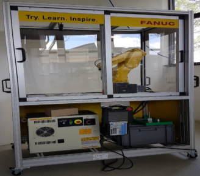
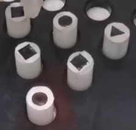

# Robot-programming-and-control
Using Teach-in Programming to control a robot arm (FANUC LR Mate 200iD 4s), so that the robot can grab six cylinders with three different symbols, identify their symbols under Kamara and finally set them down in a certain position.

## Hardware

(1) robot arm (FANUC LR Mate 200iD 4s)

(2) cylinders to be sorted

(3) "waste bin" for not expected type of cylinders

(4) store position

## Results

Please refer to [video](./Result/fanuc.mp4) for results.
